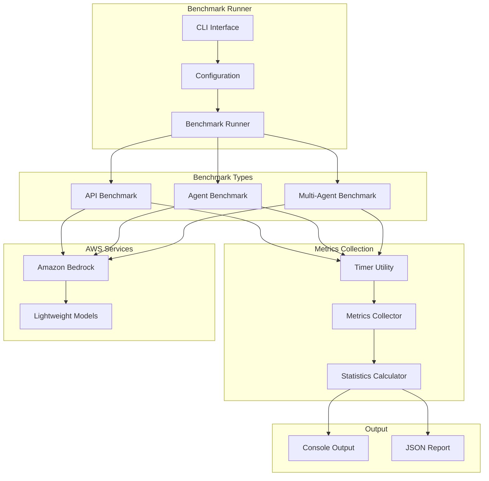

# Design Document: Bedrock Latency Benchmark

## Overview

이 시스템은 AWS Bedrock 경량 모델의 latency를 다양한 시나리오에서 측정하는 벤치마크 도구입니다. 서울 리전(ap-northeast-2)에서 사용 가능한 경량 모델(Claude Haiku, Nova Micro, Nova Lite)을 대상으로 세 가지 측정 방식을 제공합니다:

1. **Direct API**: boto3를 사용한 직접 API 호출
2. **Single Agent**: Strands Agents SDK를 사용한 단일 에이전트
3. **Multi-Agent**: Strands Agents의 멀티 에이전트 패턴 (Agents-as-Tools)

## Architecture



## Components and Interfaces

### 1. Configuration Module (`config.py`)

```python
@dataclass
class BenchmarkConfig:
    region: str = "ap-northeast-2"
    iterations: int = 10
    warmup_iterations: int = 2
    prompt: str = "Hello, how are you?"
    max_tokens: int = 100
    models: List[str] = field(default_factory=list)
    output_dir: str = "./benchmark_results"
```

### 2. Models Registry (`models.py`)

```python
LIGHTWEIGHT_MODELS = {
    "claude-3-haiku": {
        "model_id": "anthropic.claude-3-haiku-20240307-v1:0",
        "provider": "Anthropic",
        "description": "Fast, cost-effective"
    },
    "claude-3.5-haiku": {
        "model_id": "anthropic.claude-3-5-haiku-20241022-v1:0",
        "provider": "Anthropic", 
        "description": "Upgraded Haiku"
    },
    "nova-micro": {
        "model_id": "amazon.nova-micro-v1:0",
        "provider": "Amazon",
        "description": "Text-only, lowest latency"
    },
    "nova-lite": {
        "model_id": "amazon.nova-lite-v1:0",
        "provider": "Amazon",
        "description": "Multimodal, low cost"
    }
}
```

### 3. Timer Utility (`timer.py`)

```python
@dataclass
class LatencyMetrics:
    total_time_ms: float
    ttfb_ms: Optional[float] = None  # Time to first byte (streaming)
    model_time_ms: Optional[float] = None
    overhead_ms: Optional[float] = None
    
class Timer:
    def start() -> None
    def mark_first_byte() -> None
    def stop() -> LatencyMetrics
```

### 4. API Benchmark (`api_benchmark.py`)

```python
class APIBenchmark:
    def __init__(self, config: BenchmarkConfig)
    def run_single(self, model_id: str) -> LatencyMetrics
    def run_streaming(self, model_id: str) -> LatencyMetrics
    def run_benchmark(self, model_id: str) -> BenchmarkResult
```

### 5. Agent Benchmark (`agent_benchmark.py`)

```python
class AgentBenchmark:
    def __init__(self, config: BenchmarkConfig)
    def create_agent(self, model_id: str) -> Agent
    def run_benchmark(self, model_id: str) -> BenchmarkResult
```

### 6. Multi-Agent Benchmark (`multi_agent_benchmark.py`)

```python
class MultiAgentBenchmark:
    def __init__(self, config: BenchmarkConfig)
    def create_supervisor(self, model_id: str) -> Agent
    def create_worker(self, model_id: str, role: str) -> Agent
    def run_benchmark(self, model_id: str) -> MultiAgentBenchmarkResult
```

### 7. Statistics Calculator (`stats.py`)

```python
@dataclass
class BenchmarkStatistics:
    min_ms: float
    max_ms: float
    avg_ms: float
    median_ms: float
    p95_ms: float
    p99_ms: float
    std_dev_ms: float
    
def calculate_statistics(metrics: List[LatencyMetrics]) -> BenchmarkStatistics
```

### 8. Report Generator (`report.py`)

```python
class ReportGenerator:
    def generate_console_report(results: Dict) -> None
    def generate_json_report(results: Dict, filepath: str) -> None
    def compare_reports(report1: str, report2: str) -> ComparisonReport
```

## Data Models

### BenchmarkResult

```python
@dataclass
class BenchmarkResult:
    model_id: str
    model_name: str
    provider: str
    region: str
    benchmark_type: str  # "api", "agent", "multi-agent"
    timestamp: datetime
    iterations: int
    metrics: List[LatencyMetrics]
    statistics: BenchmarkStatistics
    errors: List[str]
```

### MultiAgentBenchmarkResult

```python
@dataclass
class AgentTimeline:
    agent_name: str
    start_time_ms: float
    end_time_ms: float
    model_time_ms: float
    
@dataclass
class MultiAgentBenchmarkResult(BenchmarkResult):
    agent_timelines: List[AgentTimeline]
    inter_agent_overhead_ms: float
    total_model_time_ms: float
```


## Correctness Properties

*A property is a characteristic or behavior that should hold true across all valid executions of a system-essentially, a formal statement about what the system should do. Properties serve as the bridge between human-readable specifications and machine-verifiable correctness guarantees.*

### Property 1: Latency measurements are positive
*For any* latency measurement (API, agent, or multi-agent), the recorded time in milliseconds SHALL be a positive number greater than zero.
**Validates: Requirements 2.1, 3.1, 4.1**

### Property 2: TTFB is less than or equal to total time
*For any* streaming API response, the Time To First Byte (TTFB) SHALL be less than or equal to the total response time.
**Validates: Requirements 2.2**

### Property 3: Statistics bounds invariant
*For any* list of latency measurements, the calculated statistics SHALL satisfy: min <= median <= max AND min <= avg <= max AND min <= p95 <= max AND min <= p99 <= max.
**Validates: Requirements 2.3**

### Property 4: Iteration count consistency
*For any* benchmark run with N configured iterations, the result SHALL contain exactly N latency measurements (excluding warmup).
**Validates: Requirements 2.4**

### Property 5: Benchmark result serialization round-trip
*For any* valid BenchmarkResult object, serializing to JSON and deserializing back SHALL produce an equivalent object.
**Validates: Requirements 2.6**

### Property 6: Configuration parsing round-trip
*For any* valid BenchmarkConfig object, serializing to JSON and parsing back SHALL produce an equivalent configuration.
**Validates: Requirements 2.7**

### Property 7: Agent time breakdown invariant
*For any* agent benchmark result, the total time SHALL equal model_time + tool_time + orchestration_overhead (within floating point tolerance).
**Validates: Requirements 3.2, 3.3**

### Property 8: Multi-agent time breakdown invariant
*For any* multi-agent benchmark result, the total time SHALL be greater than or equal to the maximum individual agent time, and inter_agent_overhead SHALL be non-negative.
**Validates: Requirements 4.2, 4.3**

### Property 9: Output contains required fields
*For any* benchmark result output (console or JSON), the output SHALL contain model_id, region, benchmark_type, and all latency statistics.
**Validates: Requirements 1.3, 3.4, 4.4, 5.2**

### Property 10: Comparison report consistency
*For any* two valid benchmark reports, the comparison report SHALL correctly identify which metrics improved, degraded, or remained stable.
**Validates: Requirements 5.3**

## Error Handling

### API Errors
- **ThrottlingException**: Implement exponential backoff with jitter (base: 1s, max: 30s)
- **ModelNotAvailableException**: Skip model, log warning, continue with other models
- **ValidationException**: Log error with details, fail fast for invalid configuration
- **ServiceUnavailableException**: Retry up to 3 times, then fail with clear error message

### Agent Errors
- **AgentExecutionError**: Capture error details, record as failed iteration
- **ToolExecutionError**: Record tool failure separately, continue agent execution if possible
- **TimeoutError**: Set configurable timeout (default: 60s), record timeout as error

### Data Handling
- **Invalid JSON**: Validate JSON schema before processing
- **Missing Fields**: Use default values where appropriate, error for required fields
- **File I/O Errors**: Create directories if needed, handle permission errors gracefully

## Testing Strategy

### Unit Testing Framework
- **Framework**: pytest
- **Coverage Target**: 80% code coverage

### Property-Based Testing
- **Framework**: Hypothesis (Python)
- **Minimum Iterations**: 100 per property test
- **Tag Format**: `**Feature: bedrock-latency-benchmark, Property {number}: {property_text}**`

### Test Categories

1. **Unit Tests**
   - Timer utility accuracy
   - Statistics calculation correctness
   - Configuration parsing and validation
   - Model registry operations

2. **Property-Based Tests**
   - Latency measurement positivity (Property 1)
   - TTFB <= total time (Property 2)
   - Statistics bounds (Property 3)
   - Serialization round-trips (Property 5, 6)
   - Time breakdown invariants (Property 7, 8)

3. **Integration Tests**
   - End-to-end API benchmark with mock Bedrock client
   - Agent benchmark with mock model responses
   - Multi-agent benchmark with simulated agent interactions

### Mock Strategy
- Use `moto` for AWS service mocking where applicable
- Create custom mock for Bedrock Runtime client
- Mock Strands Agent responses for deterministic testing

## File Structure

```
bedrock-latency-benchmark/
├── src/
│   ├── __init__.py
│   ├── config.py           # Configuration dataclass and parsing
│   ├── models.py           # Model registry
│   ├── timer.py            # Timer utility and metrics
│   ├── stats.py            # Statistics calculator
│   ├── api_benchmark.py    # Direct API benchmark
│   ├── agent_benchmark.py  # Single agent benchmark
│   ├── multi_agent_benchmark.py  # Multi-agent benchmark
│   ├── report.py           # Report generation
│   └── cli.py              # CLI interface
├── tests/
│   ├── __init__.py
│   ├── test_config.py
│   ├── test_timer.py
│   ├── test_stats.py
│   ├── test_api_benchmark.py
│   ├── test_agent_benchmark.py
│   ├── test_multi_agent_benchmark.py
│   ├── test_report.py
│   └── test_properties.py  # Property-based tests
├── benchmark_results/      # Output directory
├── requirements.txt
├── pyproject.toml
└── README.md
```

## Dependencies

```
boto3>=1.34.0
strands-agents>=1.0.0
hypothesis>=6.0.0
pytest>=8.0.0
rich>=13.0.0  # For console output formatting
```
